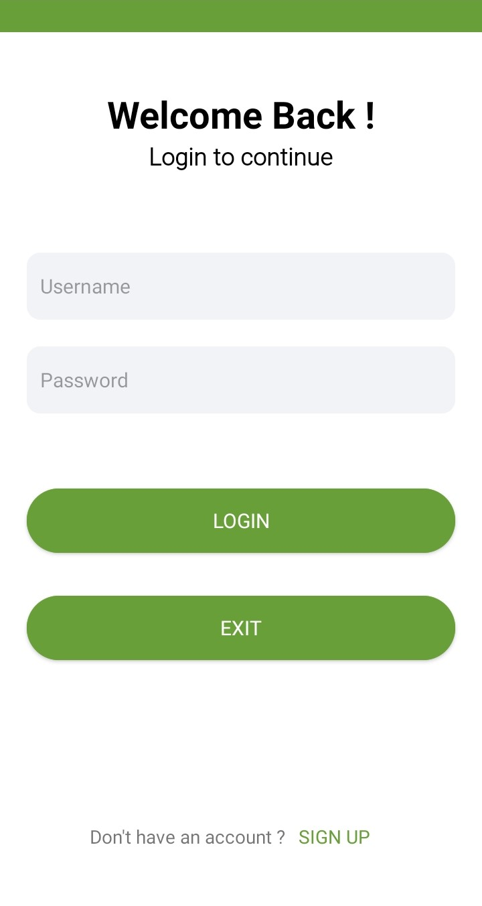
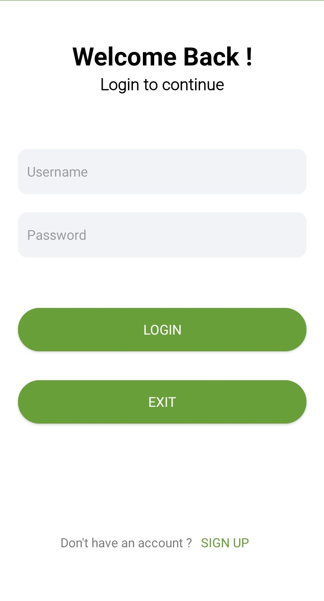
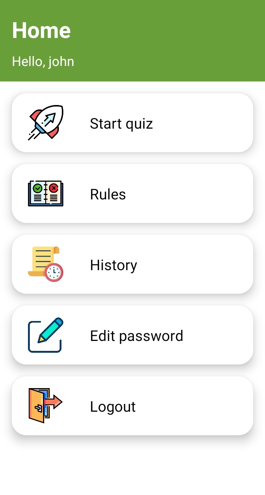
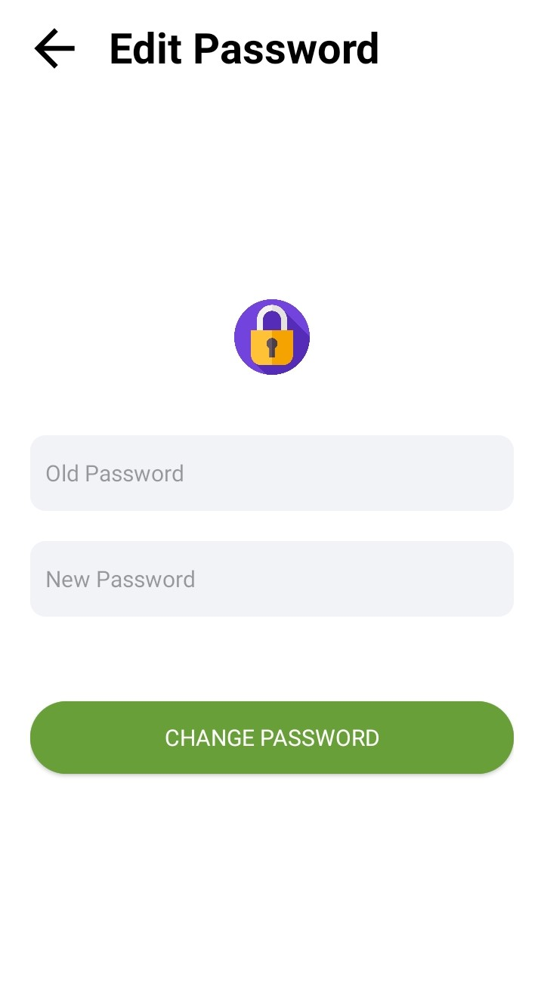
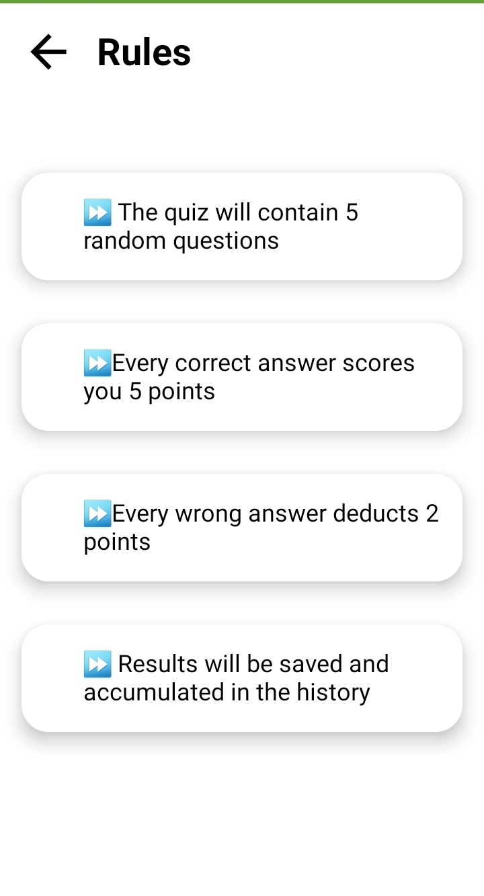
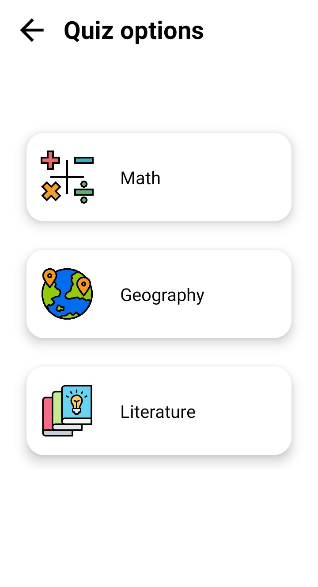
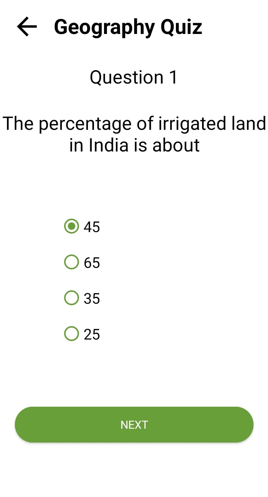
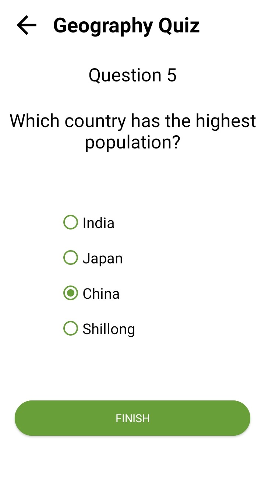
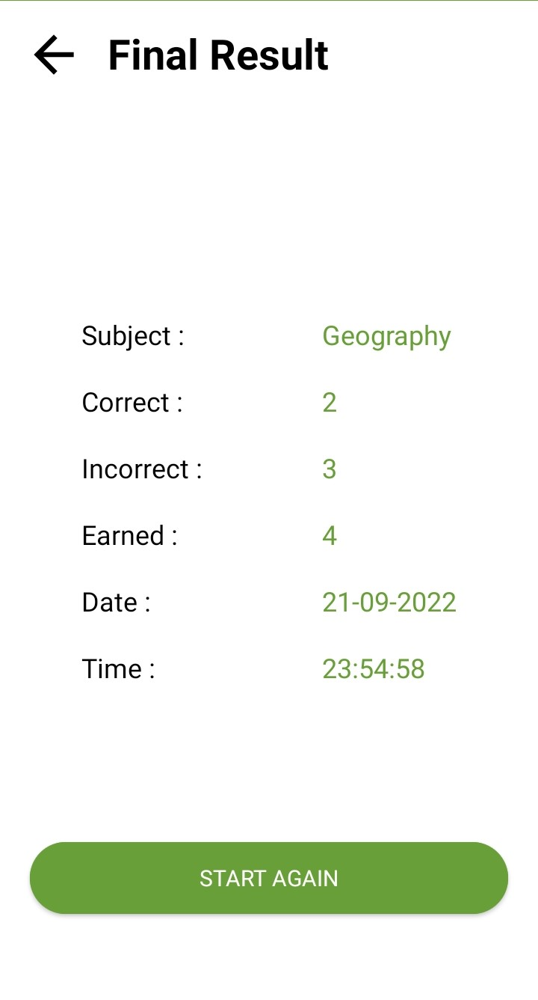
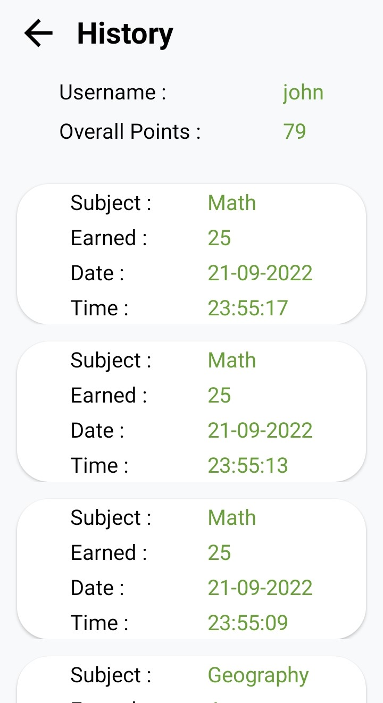

# Quiz app
## A Quiz Android application 📱 built using Kotlin and showing best practices of 🛠️ Room

## Try app ♥️
***You can Install and test latest Quiz app below 👇*** <br> 

### Get Apk [Google Play Store](https://play.google.com/store/apps/details?id=com.pratyaksh_khurana.quizz)
------------

## ⚙️ Features
- App consists of Quiz of primarily three subjects - Maths, Geography, Literature
- Maintaining history of previous attempts of quiz using Room.
- You can switch users using the Login/Register feature.
- Feature to edit password.
- Showing the result at the end the Quiz.
- Implemented login, register,edit password, previous attempts all using SQL Lite DB using Room

## 🚀 Technology Used
- App is based on MVVM architecture
- Quiz App is built using Kotlin
- Room Persistence Library

## 📸 Screenshots

||||
|:----------------------------------------:|:-----------------------------------------:|:-----------------------------------------: |
|  |  |  |
|  |  |  |
|  |  |  |
|  |  |  |


## :label: Getting Started

* First, fork the repository (Click the <b><b>Fork</b></b> button in the top right corner of the page).
* Clone the forked repository to your local machine.

```markdown
https://github.com/your-username/Quizz.git
```

* Add upstream URL 
```markdown
https://github.com/pratyaksh1610/Quizz.git
```

* Create a new branch

```markdown
git checkout -b branch_name
```

* Make your contribution
* Commit and push the changes

```markdown
git add .
git commit -m 'Relevant message'
git push origin branch_name
```

* Create a new pull request from your forked repository (Click the `New Pull Request` button located at the top of your repo)
* Wait for your PR review and approval from the maintainers.
* :star: this repository if you liked it.


## License
```
MIT License
Copyright (c) 2022 Pratyaksh Khurana
Permission is hereby granted, free of charge, to any person obtaining a copy
of this software and associated documentation files (the "Software"), to deal
in the Software without restriction, including without limitation the rights
to use, copy, modify, merge, publish, distribute, sublicense, and/or sell
copies of the Software, and to permit persons to whom the Software is
furnished to do so, subject to the following conditions:
The above copyright notice and this permission notice shall be included in all
copies or substantial portions of the Software.
THE SOFTWARE IS PROVIDED "AS IS", WITHOUT WARRANTY OF ANY KIND, EXPRESS OR
IMPLIED, INCLUDING BUT NOT LIMITED TO THE WARRANTIES OF MERCHANTABILITY,
FITNESS FOR A PARTICULAR PURPOSE AND NONINFRINGEMENT. IN NO EVENT SHALL THE
AUTHORS OR COPYRIGHT HOLDERS BE LIABLE FOR ANY CLAIM, DAMAGES OR OTHER
LIABILITY, WHETHER IN AN ACTION OF CONTRACT, TORT OR OTHERWISE, ARISING FROM,
OUT OF OR IN CONNECTION WITH THE SOFTWARE OR THE USE OR OTHER DEALINGS IN THE
SOFTWARE.
```


